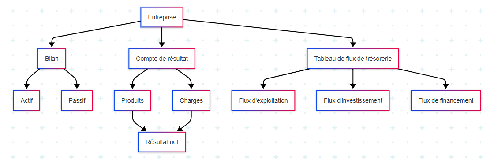

# 02 documents financiers

## Introduction

Les documents financiers sont essentiels pour comprendre la santé économique d'une entreprise. Ils permettent aux dirigeants, investisseurs et autres parties prenantes d’évaluer la performance, la rentabilité, la solvabilité et la trésorerie d’une entité. Ce tutoriel aborde les trois principaux documents comptables : le **bilan**, le **compte de résultat** et le **tableau de flux de trésorerie**.

---

## 1. Le bilan comptable

Le **bilan** présente la situation financière d’une entreprise à un instant donné. Il se compose de deux parties :
- **Actif** : ce que possède l’entreprise (immobilisations, créances, trésorerie).
- **Passif** : ce que doit l’entreprise (capitaux propres, dettes).

L’équation fondamentale est :  
**Actif = Passif**

---

## 2. Le compte de résultat

Le **compte de résultat** retrace l’ensemble des produits (revenus) et des charges (dépenses) sur une période donnée. Il permet de déterminer si l’entreprise a réalisé un bénéfice ou une perte.

Formule principale :  
**Résultat = Produits - Charges**

---

## 3. Le tableau de flux de trésorerie

Ce tableau indique les entrées et sorties de trésorerie selon trois activités :
- **Activité opérationnelle** (exploitation)
- **Activité d’investissement** (achats/ventes d’actifs)
- **Activité de financement** (emprunts, dividendes)

Il permet d'analyser la capacité de l'entreprise à générer du cash.

---

## 4. Tableau récapitulatif de synthèse

| Document                | Objectif principal                              | Période ou instant | Contenu clé                                | Utilisateurs                     |
|-------------------------|--------------------------------------------------|--------------------|--------------------------------------------|----------------------------------|
| Bilan                   | Photographie de la situation financière         | À un instant T     | Actif (ce que l’entreprise possède), Passif (ce qu’elle doit) | Investisseurs, Banquiers, Dirigeants |
| Compte de résultat      | Mesure de la performance                        | Sur une période    | Produits, Charges, Résultat net             | Actionnaires, Analystes          |
| Tableau de flux de trésorerie | Analyse des flux de liquidité                | Sur une période    | Flux opérationnels, d’investissement et de financement | Trésorier, Investisseurs         |

---

## 5. Représentation schématique 

---

### Conclusion
Ces trois documents sont interconnectés et offrent une vue complémentaire de l’activité et de la situation d'une entreprise. Les maîtriser est essentiel pour tout professionnel de la finance, analyste ou entrepreneur.
