# Logique Globale de l’Analyse Financière

L’analyse financière vise à évaluer la santé et la performance d’une entreprise à partir de ses états comptables. Elle s’appuie sur une lecture structurée et méthodique de plusieurs documents financiers, en les interprétant avec des outils tels que les indicateurs, les soldes intermédiaires de gestion (SIG), les ratios et les flux de trésorerie.

---

## 🔍 Objectifs de l’analyse financière

- **Évaluer la solvabilité** à court et long terme
- **Mesurer la rentabilité** économique et financière
- **Apprécier la structure du financement**
- **Identifier les zones de risque et d’opportunité**
- **Orienter la prise de décision** (investissement, crédit, croissance…)

---

## 🧭 Démarche classique en trois lectures complémentaires

L’analyse suit une logique en **trois lectures successives**, correspondant aux principaux documents comptables.

---

### 1. 📘 Lecture du Bilan : Analyse Structurelle

Cette première lecture vise à comprendre **la structure financière** de l’entreprise, ses équilibres de financement, sa liquidité et sa solvabilité.

#### Indicateurs Fonctionnels :
- Fonds de Roulement Net Global (FRNG)
- Besoin en Fonds de Roulement (BFR)
- Trésorerie Nette (TN)

#### Ratios structurels :
- Ratio d’autonomie financière
- Ratio d’endettement
- Ratios de liquidité générale et réduite

> 🎯 **Objectif** : évaluer la stabilité de l’entreprise et sa capacité à faire face à ses engagements.

---

### 2. 📗 Lecture du Compte de Résultat : Analyse de la Performance

L’accent est mis ici sur **les flux d’activité** et la création de valeur.

#### Soldes Intermédiaires de Gestion (SIG) :
- Marge commerciale (activité de négoce)
- Production de l’exercice (industrie)
- Valeur ajoutée
- Excédent brut d’exploitation (EBE)
- Résultat d’exploitation, courant, exceptionnel, net

#### Ratios de performance :
- Taux de marge brute
- Taux de marge nette
- Taux de rentabilité économique (ROA)
- Taux de rentabilité financière (ROE)

> 🎯 **Objectif** : analyser la profitabilité et la performance économique de l’activité.

---

### 3. 📙 Lecture des Flux de Trésorerie : Analyse de la Viabilité

Cette lecture permet d’évaluer **la capacité de l’entreprise à générer du cash** et à financer son activité.

#### Outils :
- Tableau des flux de trésorerie
- Capacité d’autofinancement (CAF)
- Analyse du cycle d’exploitation

> 🎯 **Objectif** : juger la résilience financière et la capacité à autofinancer les investissements.

---

## 🧩 Synthèse : articulation des trois lectures

```mermaid
flowchart TD
    A(Bilan: Structure financière) --> B(Compte de résultat: Performance)
    B --> C(Trésorerie: Viabilité financière)
    C --> D{Diagnostic global}
    D --> E1(Orientation stratégique)
    D --> E2(Aide à la décision)
```

---
## Prochain chapitre

👉 [Les Pricipaux Indicateurs](./04_indicateurs_cles.md)