# Tutoriel 03 : Les indicateurs financiers clés

## Introduction

Comprendre les indicateurs financiers est essentiel pour évaluer la performance économique et la santé d’une entreprise. Ils permettent de prendre des décisions éclairées en matière d’investissement, de gestion ou de stratégie. Ce tutoriel présente les indicateurs les plus utilisés dans l’analyse financière.
Dans les prochains tutos, vous trouverez plus de détails sur ces indicateurs avec des aaplications sur des exemples concrets; ainsi que d'autres indicateurs de santé financière.

---

## 1. Rentabilité

### Marge nette
**Formule** : Résultat net / Chiffre d’affaires  
Elle mesure la rentabilité nette de l’activité après toutes les charges.

### ROE (Return on Equity)
**Formule** : Résultat net / Capitaux propres  
Elle indique la rentabilité des fonds investis par les actionnaires.

### ROA (Return on Assets)
**Formule** : Résultat net / Total actif  
Elle mesure la rentabilité économique globale de l’entreprise.

---

## 2. Structure financière

### Ratio d’endettement
**Formule** : Dettes financières / Capitaux propres  
Il reflète la dépendance de l’entreprise vis-à-vis de l’endettement.

### Autonomie financière
**Formule** : Capitaux propres / Total passif  
Ce ratio mesure la capacité de l’entreprise à se financer par ses fonds propres.

---

## 3. Activité et productivité

### Rotation des stocks
**Formule** : Coût des ventes / Stock moyen  
Indique la vitesse de renouvellement des stocks.

### Délai moyen de paiement client
**Formule** : (Créances clients / Chiffre d'affaires) × 365  
Mesure le temps moyen mis par les clients pour régler leurs factures.

---

## 4. Liquidité

### Ratio de liquidité générale
**Formule** : Actif circulant / Passif circulant  
Évalue la capacité à faire face aux dettes à court terme.

### Ratio de liquidité immédiate (ou « quick ratio »)
**Formule** : (Actif circulant - Stocks) / Passif circulant  
Mesure la solvabilité immédiate sans tenir compte des stocks.

---

## 5. Tableau récapitulatif

| Indicateur                        | Formule simplifiée                               | Objectif principal                         | Bon niveau (référence) |
|----------------------------------|--------------------------------------------------|--------------------------------------------|-------------------------|
| Marge nette                      | Résultat net / CA                                | Rentabilité nette                          | > 5% selon secteurs     |
| ROE                              | Résultat net / Capitaux propres                  | Rentabilité des fonds propres              | 10-15% appréciés        |
| ROA                              | Résultat net / Total actif                       | Rentabilité globale                        | > 5% selon secteurs     |
| Ratio d’endettement              | Dettes financières / Capitaux propres            | Niveau d’endettement                       | < 1 ou 100% conseillé   |
| Autonomie financière             | Capitaux propres / Total passif                  | Indépendance financière                    | > 30%                   |
| Rotation des stocks              | Coût des ventes / Stock moyen                    | Efficacité de gestion des stocks           | > 5 selon secteur       |
| Délai moyen de paiement client   | (Créances / CA) × 365                            | Gestion de la trésorerie client            | 30-60 jours             |
| Liquidité générale               | Actif circulant / Passif circulant               | Capacité à honorer les dettes              | > 1                     |
| Liquidité immédiate              | (Actif circ. - Stocks) / Passif circ.            | Solvabilité à court terme                  | > 0.8                   |

---

## 6. Diagramme Mermaid – Relations entre les indicateurs

```mermaid
graph LR
    A[Performance globale] --> B[Rentabilité]
    A --> C[Structure financière]
    A --> D[Liquidité]
    A --> E[Activité & Productivité]

    B --> B1[Marge nette]
    B --> B2[ROE]
    B --> B3[ROA]

    C --> C1[Ratio d'endettement]
    C --> C2[Autonomie financière]

    D --> D1[Liquidité générale]
    D --> D2[Liquidité immédiate]

    E --> E1[Rotation des stocks]
    E --> E2[Délai paiement client]
```

---
## Prochain tuto

👉 [Petit Aperçu sur le Bilan: Bilan Simplifié](../02_Analyse_bilan/01_bilan_simplifie.md)
