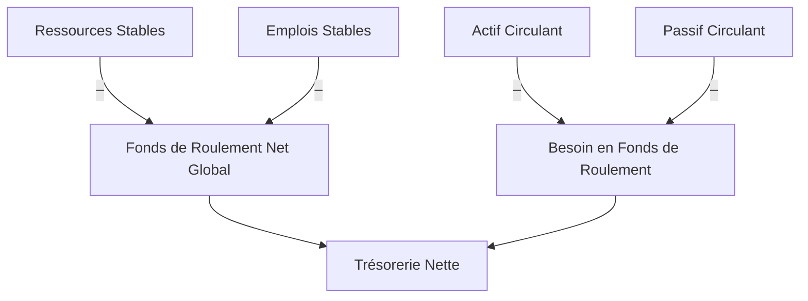

# 📊 Indicateurs clés du Bilan Fonctionnel

Le **bilan fonctionnel** est une relecture du bilan comptable orientée vers l’analyse financière. Il regroupe les postes en **emplois** (utilisations de fonds) et **ressources** (origines de fonds), afin de juger la **structure financière** de l’entreprise sur le moyen et long terme.

---

## 🧱 Objectif du bilan fonctionnel

Il permet de :
- mesurer l’équilibre financier de l’entreprise,
- identifier la capacité à financer ses investissements avec ses ressources stables,
- évaluer la dépendance à la trésorerie court terme.

---

## 🧾 Regroupement fonctionnel des postes

| Catégorie               | Postes concernés                                   |
|-------------------------|----------------------------------------------------|
| **Emplois stables**     | Immobilisations brutes                             |
| **Ressources stables**  | Capitaux propres + dettes financières MLT          |
| **Actif circulant**     | Stocks + créances d’exploitation                   |
| **Passif circulant**    | Dettes d’exploitation (fournisseurs, fiscales...)  |
| **Trésorerie active**   | Disponibilités                                     |
| **Trésorerie passive**  | Concours bancaires courants                        |

---

## 📌 Indicateurs fondamentaux

### 1. **Fonds de Roulement Net Global (FRNG)**

**Formule :**  
`FRNG = Ressources stables – Emplois stables`

- Mesure la capacité à financer l’actif circulant avec des ressources longues.
- Un FRNG > 0 est souhaitable.

### 2. **Besoin en Fonds de Roulement (BFR)**

**Formule :**  
`BFR = Actif circulant d’exploitation – Passif circulant d’exploitation`

- Représente le financement nécessaire au cycle d’exploitation.
- BFR positif = besoin, BFR négatif = ressource.

### 3. **Trésorerie Nette (TN)**

**Formule :**  
`TN = FRNG – BFR`  
ou  
`TN = Trésorerie active – Trésorerie passive`

- Permet de juger de la **position de trésorerie** à court terme.
- Une TN positive traduit un excédent de liquidité.

---

## 📋 Tableau récapitulatif

| Indicateur | Formule | Interprétation |
|------------|---------|----------------|
| **FRNG**   | Ressources stables – Emplois stables | Solvabilité à moyen/long terme |
| **BFR**    | Actif circulant – Passif circulant   | Équilibre du cycle d’exploitation |
| **TN**     | FRNG – BFR ou Trésorerie active – passive | Position de trésorerie nette |

---
## 🎯 Exemple illustratif

Imaginons une entreprise avec les éléments suivants (en €) :

| Élément                  | Montant (€) |
| ------------------------ | ----------- |
| Capitaux propres         | 120 000     |
| Emprunts long terme      | 60 000      |
| Immobilisations          | 150 000     |
| Stocks                   | 20 000      |
| Créances clients         | 30 000      |
| Fournisseurs             | 15 000      |
| Dettes fiscales/sociales | 10 000      |
| Trésorerie active        | 10 000      |
| Découvert bancaire       | 5 000       |

### Calculs :

* **FRNG =** (120 000 + 60 000) – 150 000 = **30 000 €**
* **BFR =** (20 000 + 30 000) – (15 000 + 10 000) = **25 000 €**
* **Trésorerie Nette =** 30 000 – 25 000 = **5 000 €**

💡 **Interprétation :** La société dégage une trésorerie excédentaire, ce qui témoigne d’une gestion équilibrée de ses cycles d’exploitation et d’investissement.

---

#### 📌 Points de vigilance

* Un FRNG négatif = ressources stables insuffisantes pour couvrir les immobilisations.
* Un BFR élevé = dépendance accrue au financement court terme.
* Une TN négative = tension de trésorerie.

---

#### 🔚 Conclusion

L’analyse fonctionnelle du bilan constitue un socle essentiel pour évaluer :

* l’indépendance financière de l’entreprise,
* sa capacité à faire face à ses échéances,
* son agilité opérationnelle.

---
## 🧩 Visualisation avec Mermaid

---
## Prochain chapitre

👉 [Les Ratios Structurels du Bilan](./03_ratios_structurels_bilan.md)