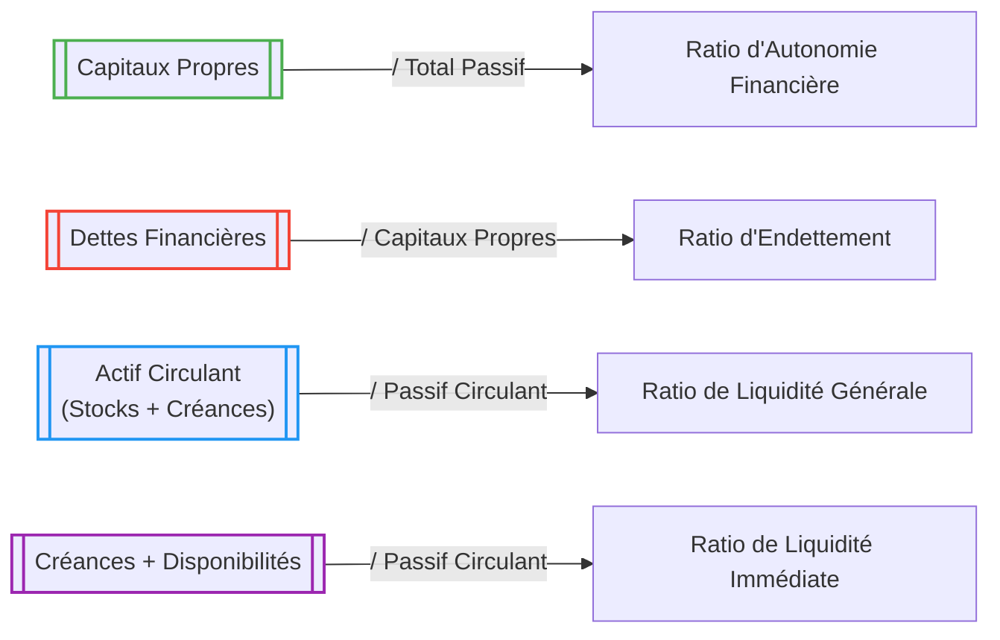

# 📊 Ratios Structurels du Bilan

L’analyse structurelle du bilan passe par le calcul de **ratios financiers** qui révèlent la **solidité**, la **solvabilité**, et la **liquidité** de l’entreprise. Ces ratios sont des **indicateurs de structure** : ils ne mesurent pas la performance ou la rentabilité, mais bien la **capacité à résister à moyen ou long terme**.

---

## 🧱 1. Ratio d'autonomie financière

**Formule :**  
`Autonomie financière = Capitaux propres / Total passif`

- Mesure la part de l’entreprise financée par ses fonds propres.
- Plus ce ratio est élevé, plus l’entreprise est indépendante financièrement.

**Interprétation :**
- > 50 % : bonne autonomie financière.
- < 30 % : dépendance élevée aux financements externes.

---

## 💣 2. Ratio d’endettement (ou Levier financier)

**Formule :**  
`Endettement = Dettes financières / Capitaux propres`

- Évalue le niveau d’endettement par rapport aux fonds propres.
- Permet de juger du **risque financier**.

**Interprétation :**
- < 1 : endettement modéré.
- > 1 : effet de levier important, potentiellement risqué.

---

## 💧 3. Ratio de liquidité générale

**Formule :**  
`Liquidité générale = Actif circulant / Passif circulant`

- Mesure la capacité de l’entreprise à faire face à ses dettes à court terme.

**Interprétation :**
- > 1 : situation confortable.
- < 1 : risque de tension de trésorerie.

---

## 🧪 4. Ratio de liquidité réduite (ou « test acide »)

**Formule :**  
`Liquidité réduite = (Créances clients + Disponibilités) / Passif circulant`

- Variante du ratio précédent, sans les stocks (moins liquides).

**Interprétation :**
- > 1 : bonne liquidité immédiate.
- 0,5 – 1 : acceptable.
- < 0,5 : fragilité financière.

---

## 📋 Tableau synthétique

| Ratio                           | Formule                                           | Seuil souhaitable   | Sens financier                          |
|---------------------------------|---------------------------------------------------|----------------------|------------------------------------------|
| Autonomie financière            | Capitaux propres / Total passif                  | > 0,5 (50%)          | Indépendance financière                  |
| Endettement                     | Dettes financières / Capitaux propres            | < 1                  | Niveau de risque financier               |
| Liquidité générale              | Actif circulant / Passif circulant              | > 1                  | Couverture des dettes CT                 |
| Liquidité réduite (test acide) | (Créances + Trésorerie) / Passif circulant       | > 0,5                | Tension de trésorerie à CT               |

---

## 🔍 Exemple chiffré

| Poste                               | Montant (€) |
|-------------------------------------|-------------|
| Capitaux propres                    | 120 000     |
| Total passif                        | 300 000     |
| Dettes financières                  | 90 000      |
| Actif circulant (stocks inclus)     | 80 000      |
| Créances clients                    | 30 000      |
| Trésorerie                          | 10 000      |
| Passif circulant                    | 60 000      |

### Calculs :

- **Autonomie financière** = 120 000 / 300 000 = **0,40** (40%)
- **Endettement** = 90 000 / 120 000 = **0,75**
- **Liquidité générale** = 80 000 / 60 000 = **1,33**
- **Liquidité réduite** = (30 000 + 10 000) / 60 000 = **0,67**

**Interprétation :**
- Bonne liquidité à court terme,
- Endettement modéré,
- Autonomie financière moyenne mais acceptable.

---

## 📊 Diagramme explicatif en Mermaid

---
## Prochain tuto

👉 [Structure Financière pour évaluer la santé de l'E/se](./04_structure_financiere.md)