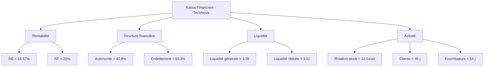

# 03 – Cas pratique : Calcul des ratios financiers clés

Ce cas pratique illustre le calcul des principaux ratios financiers à partir des données comptables d’une entreprise fictive nommée **TechNova SARL**.

---

## Données extraites du bilan et du compte de résultat (exercice N)

| Poste                          | Montant (€)         |
|--------------------------------|----------------------|
| Chiffre d'affaires (TTC)       | 1 200 000            |
| Résultat d’exploitation        | 95 000               |
| Résultat net                   | 60 000               |
| Capitaux propres               | 300 000              |
| Total du bilan                 | 700 000              |
| Dettes financières             | 280 000              |
| Actif circulant                | 250 000              |
| Passif circulant               | 180 000              |
| Stocks                         | 50 000               |
| Créances clients               | 150 000              |
| Dettes fournisseurs            | 90 000               |
| Achats TTC                     | 600 000              |
| Coût des ventes                | 750 000              |
| Stock moyen                    | 60 000               |

---

## 1. Ratios de rentabilité

### Rentabilité économique (RE)

**Formule** : Résultat d’exploitation / Total des capitaux engagés  
→ Capitaux engagés ≈ Total du bilan = 700 000 €  
**Calcul** : 95 000 / 700 000 = **0,1357 → 13,57 %**

### Rentabilité financière (RF)

**Formule** : Résultat net / Capitaux propres  
**Calcul** : 60 000 / 300 000 = **0,20 → 20 %**

---

## 2. Ratios de structure financière

### Autonomie financière

**Formule** : Capitaux propres / Total bilan  
**Calcul** : 300 000 / 700 000 = **0,428 → 42,8 %**

### Endettement global

**Formule** : Dettes financières / Capitaux propres  
**Calcul** : 280 000 / 300 000 = **0,933 → 93,3 %**

---

## 3. Ratios de liquidité

### Liquidité générale

**Formule** : Actif circulant / Passif circulant  
**Calcul** : 250 000 / 180 000 = **1,39**

### Liquidité réduite

**Formule** : (Actif circulant – Stocks) / Passif circulant  
**Calcul** : (250 000 – 50 000) / 180 000 = 200 000 / 180 000 = **1,11**

---

## 4. Ratios d’activité

### Rotation des stocks

**Formule** : Coût des ventes / Stock moyen  
**Calcul** : 750 000 / 60 000 = **12,5 fois / an**

### Délai moyen de paiement clients

**Formule** : (Créances clients / CA TTC) × 360  
**Calcul** : (150 000 / 1 200 000) × 360 = 0,125 × 360 = **45 jours**

### Délai moyen de paiement fournisseurs

**Formule** : (Dettes fournisseurs / Achats TTC) × 360  
**Calcul** : (90 000 / 600 000) × 360 = 0,15 × 360 = **54 jours**

---

## Résumé des résultats

| **Ratio**                         | **Valeur calculée**  | **Interprétation**                                        |
|----------------------------------|-----------------------|-----------------------------------------------------------|
| Rentabilité économique           | 13,57 %               | Rentable sur ses investissements                          |
| Rentabilité financière           | 20 %                  | Bonne rémunération des actionnaires                      |
| Autonomie financière             | 42,8 %                | Situation saine mais améliorable                          |
| Endettement global               | 93,3 %                | Endettement élevé mais encore maîtrisé                   |
| Liquidité générale               | 1,39                  | Bonne solvabilité à court terme                           |
| Liquidité réduite                | 1,11                  | Légère marge de sécurité hors stocks                     |
| Rotation des stocks              | 12,5 fois/an          | Gestion efficace du stock                                 |
| Délai paiement clients           | 45 jours              | Délai client correct (souvent entre 30 et 60 jours)       |
| Délai paiement fournisseurs      | 54 jours              | L’entreprise négocie bien ses règlements fournisseurs     |

---

## Diagramme Mermaid – Ratios calculés

---
## Prochain tuto

👉 [Autre cas pratique](./06_cas_pratique_structure_financiere.md)
