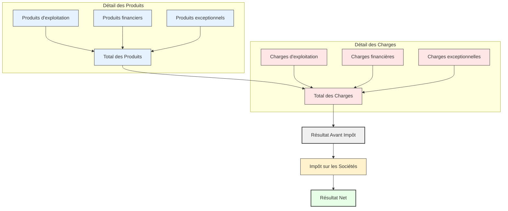

## Le Compte de Résultat Simplifié  : Une Vision de la Performance

Le **compte de résultat** est le rapport financier qui illustre la **performance économique** d'une entreprise sur une période donnée (généralement un exercice fiscal d'un an). Il retrace tous les **revenus** (produits) générés et toutes les **dépenses** (charges) engagées pour les obtenir, aboutissant au **résultat net** (bénéfice ou perte).

Ce document est fondamental car il révèle l'efficacité avec laquelle l'entreprise transforme ses ventes en profits, en décomposant les différentes strates de coûts et de revenus.

### La Logique Fondamentale : Produits vs. Charges

Le principe reste simple : le résultat est la différence entre ce que l'entreprise a gagné et ce qu'elle a dépensé.

$$\text{Total des Produits} - \text{Total des Charges} = \text{Résultat Net}$$

Cependant, pour affiner l'analyse, ces produits et charges sont classés par nature :
* **Charges d'exploitation :** Liées à l'activité courante et normale de l'entreprise (achats, salaires, loyers).
* **Charges financières :** Liées à l'endettement ou aux opérations financières (intérêts des emprunts).
* **Charges exceptionnelles :** Liées à des événements rares ou non récurrents.
* **Produits d'exploitation :** Provenant de l'activité principale (ventes, prestations de services).
* **Produits financiers :** Provenant des placements ou de la gestion de trésorerie (intérêts reçus).
* **Produits exceptionnels :** Provenant d'événements non liés à l'activité courante.

### Exemple Enrichi : Le Compte de Résultat de "GreenTech Solutions" (Exercice N)

Prenons l'exemple de "GreenTech Solutions", une entreprise fictive de conseil en énergie renouvelable, pour illustrer un compte de résultat plus détaillé.

**Compte de Résultat (simplifié enrichi) de "GreenTech Solutions"**
*Pour l'exercice clos le 31 décembre N*

| CHARGES                         | MONTANT (€) | PRODUITS                      | MONTANT (€) |
| :------------------------------ | :---------- | :---------------------------- | :---------- |
| **Charges d'exploitation** | **280 000** | **Produits d'exploitation** | **400 000** |
| Achats de fournitures           | 30 000      | Ventes de prestations de services | 380 000     |
| Frais de personnel (salaires + charges sociales) | 120 000     | Autres produits d'exploitation | 20 000      |
| Services extérieurs (loyers, sous-traitance, pub) | 80 000      |                               |             |
| Impôts et taxes (hors IS)       | 15 000      |                               |             |
| Dotations aux amortissements et provisions | 35 000      |                               |             |
|                                 |             |                               |             |
| **Charges financières** | **5 000** | **Produits financiers** | **1 000** |
| Intérêts sur emprunts           | 5 000       | Intérêts de placements        | 1 000       |
|                                 |             |                               |             |
| **Charges exceptionnelles** | **2 000** | **Produits exceptionnels** | **7 000** |
| Amendes et pénalités            | 2 000       | Cessions d'immobilisations (plus-value) | 7 000       |
|                                 |             |                               |             |
| **TOTAL DES CHARGES** | **287 000** | **TOTAL DES PRODUITS** | **408 000** |
| **Résultat avant impôt** | **121 000** |                               |             |
| Impôt sur les sociétés (IS)     | 30 250      |                               |             |
| **Résultat net (bénéfice)** | **90 750** | **TOTAL GÉNÉRAL** | **408 000** |
| **TOTAL GÉNÉRAL** | **408 000** |                               |             |

### Analyse de l'Exemple "GreenTech Solutions" :

1.  **Activités Principales (Exploitation) :**
    * **Produits d'exploitation (400 000 €) :** La majeure partie du revenu provient des services de conseil, avec une petite part issue d'activités complémentaires.
    * **Charges d'exploitation (280 000 €) :** Les charges de personnel sont les plus importantes, ce qui est normal pour une entreprise de services. Les amortissements montrent que l'entreprise utilise des immobilisations qui se déprécient.
    * **Premier niveau de Résultat (non affiché directement dans le tableau mais implicite) :** Le Résultat d'Exploitation serait ici de 400 000 € - 280 000 € = **120 000 €**. C'est le profit tiré du cœur de métier.

2.  **Activités Financières :**
    * **Charges financières (5 000 €) :** Indiquent que l'entreprise a des emprunts ou d'autres financements qui lui coûtent des intérêts.
    * **Produits financiers (1 000 €) :** Montrent un petit revenu lié à des placements de trésorerie.
    * **Résultat Financier = -4 000 €** (1 000 - 5 000). Il y a un coût net lié à la gestion financière.

3.  **Activités Exceptionnelles :**
    * **Produits exceptionnels (7 000 €) :** Une plus-value sur la vente d'une immobilisation est un bon exemple d'élément non récurrent qui améliore le résultat.
    * **Charges exceptionnelles (2 000 €) :** Une amende est une dépense ponctuelle.
    * **Résultat Exceptionnel = 5 000 €** (7 000 - 2 000).

4.  **Résultat Avant Impôt :**
    * C'est la somme du Résultat d'Exploitation (120 000 €) + Résultat Financier (-4 000 €) + Résultat Exceptionnel (5 000 €) = **121 000 €**. C'est le profit total avant la déduction de l'impôt sur les sociétés.

5.  **Impôt sur les Sociétés (IS) :**
    * La charge fiscale calculée sur le Résultat avant impôt.

6.  **Résultat Net (Bénéfice) :**
    * **90 750 €**. C'est le montant final qui reste à l'entreprise après toutes les déductions. Ce bénéfice peut être mis en réserves (réinvesti dans l'entreprise) ou distribué aux actionnaires (dividendes).

### Diagramme de Flux du Compte de Résultat Simplifié Enrichi

Le diagramme reflète toujours la même logique, mais les sous-catégories des charges et produits sont implicitement plus variées comme dans notre exemple.

*Figure 1 : Flux simplifié enrichi du compte de résultat*

### Tableau Récapitulatif : Les Paliers du Compte de Résultat Simplifié Enrichi

| Palier d'Analyse            | Calcul / Description                                                                   | Ce qu'il mesure                                                                               |
| :-------------------------- | :------------------------------------------------------------------------------------- | :-------------------------------------------------------------------------------------------- |
| **TOTAL DES PRODUITS** | Somme des Produits d'exploitation, financiers et exceptionnels.                        | Tous les revenus générés par l'entreprise, quelle que soit leur origine.                      |
| **TOTAL DES CHARGES** | Somme des Charges d'exploitation, financières et exceptionnelles.                      | Toutes les dépenses et consommations de l'entreprise.                                          |
| **Résultat Avant Impôt** | Total des Produits - Total des Charges (avant IS).                                   | La performance globale de l'entreprise avant la prise en compte de la fiscalité.              |
| **Impôt sur les Sociétés (IS)** | Charge fiscale calculée sur le Résultat Avant Impôt.                                | La part du profit reversée à l'État.                                                          |
| **Résultat Net (Bénéfice/Perte)** | Résultat Avant Impôt - Impôt sur les Sociétés.                                     | Le profit (ou la perte) final de l'entreprise, disponible pour les propriétaires ou le réinvestissement. |

---

## Prochain tuto

👉 [Le Solde Intermédiaire de Gestion](./02_SIG.md)
