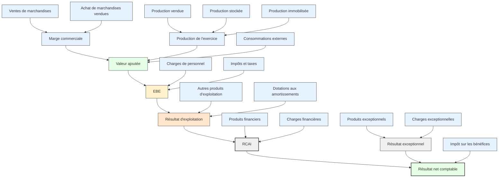

# Tutoriel : Le Solde Intermédiaire de Gestion (SIG)

## Introduction

Le **Solde Intermédiaire de Gestion (SIG)** est un outil d'analyse financière qui décompose le **compte de résultat** pour mieux comprendre la formation du résultat d’une entreprise. Il met en évidence plusieurs soldes successifs, chacun révélant une étape de la création de valeur.
Autrement dit, le SIG sert à découper les résultats d’une entreprise en plusieurs étapes, pour mieux comprendre comment elle gagne de l’argent et où elle en dépense. Cela aide à voir, étape par étape, comment se forme le bénéfice. On dit ici qu'on procède par "cascade".

---

## 1. Objectifs des SIG

- Comprendre la performance opérationnelle.
- Identifier les marges et les excédents à chaque étape de gestion.
- Mieux piloter l’entreprise à travers des indicateurs économiques.
- Comparer avec des entreprises du même secteur.

---

## 2. Les principaux SIG à connaître

### 1. Marge commerciale
**Formule** : Ventes de marchandises – Coût d’achat des marchandises vendues  
➡️ Utilisé pour les entreprises commerciales.

---

### 2. Production de l’exercice
**Formule** : Production vendue + Production stockée + Production immobilisée  
➡️ Indique la valeur ajoutée par l’activité de production.

---

### 3. Valeur ajoutée (VA)
**Formule** : Marge commerciale + Production de l’exercice – Consommations externes  
➡️ Mesure la richesse créée par l’entreprise à partir de ses activités.

---

### 4. Excédent Brut d’Exploitation (EBE)
**Formule** : Valeur ajoutée – Charges de personnel – Impôts et taxes  
➡️ Reflète la performance de l’exploitation, sans tenir compte de la politique d’amortissement ni de financement.

---

### 5. Résultat d’exploitation
**Formule** : EBE + Autres produits d’exploitation – Dotations aux amortissements et provisions  
➡️ Tient compte des dotations et des reprises, mais pas encore du résultat financier.

---

### 6. Résultat courant avant impôts (RCAI)
**Formule** : Résultat d’exploitation + Résultat financier  
➡️ Intègre les charges et produits financiers (intérêts, placements…).

---

### 7. Résultat exceptionnel
**Formule** : Produits exceptionnels – Charges exceptionnelles  
➡️ Événements inhabituels ou non récurrents.

---

### 8. Résultat net comptable
**Formule** : RCAI + Résultat exceptionnel – Impôt sur les bénéfices  
➡️ Dernier niveau de résultat, celui qui figure au bilan.

---

## 3. Tableau récapitulatif des SIG

| Solde intermédiaire               | Formule simplifiée                                            | Ce qu’il indique                                      |
|----------------------------------|---------------------------------------------------------------|-------------------------------------------------------|
| Marge commerciale                | Ventes – Achats revendus                                      | Rentabilité brute d’une activité commerciale          |
| Production de l’exercice         | Prod. vendue + stockée + immobilisée                          | Activité de production                               |
| Valeur ajoutée                   | Marge + Production – Consommations externes                   | Création de richesse propre                          |
| Excédent Brut d’Exploitation     | VA – Charges personnel – Impôts & taxes                       | Rentabilité opérationnelle brute                     |
| Résultat d’exploitation          | EBE + Autres produits – Dotations amort. & provisions         | Résultat purement industriel                         |
| Résultat courant avant impôts    | Résultat d’exploitation + Résultat financier                  | Résultat avant impôts et éléments exceptionnels       |
| Résultat exceptionnel            | Produits – Charges exceptionnels                              | Événements non récurrents                            |
| Résultat net                     | RCAI + Résultat exceptionnel – Impôts                         | Bénéfice ou perte final(e)                           |

---
## 4. Cas pratique de calcul des SIG
👉 [Exemple_pratique](./cas_pratique_SIG.md)

---

## 5. Diagramme Mermaid – Construction des SIG

---
## Prochain tuto

👉 [Les Ratios de Rentabilité et la Capacité d'autofinancement](./03_ratios_rentabilite_et_CAF.md)
