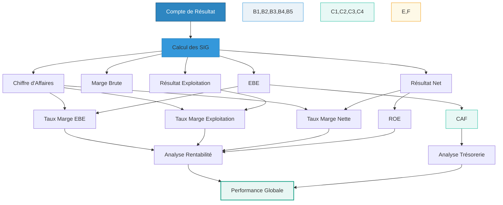

Poursuivons notre exploration du compte de résultat en allant au-delà des simples lignes de chiffres. 
Ce troisième tutoriel vous guidera à travers les **ratios de rentabilité** et le concept fondamental de la **Capacité d'Autofinancement (CAF)**. Ces outils sont indispensables pour évaluer l'efficacité de l'entreprise à générer du profit et du cash.

---

## Ratios de Rentabilité et Capacité d'Autofinancement (CAF) : Au Cœur de la Performance

Après avoir compris la structure du compte de résultat et la signification des Soldes Intermédiaires de Gestion (SIG), l'étape suivante consiste à interpréter ces chiffres. C'est là que les **ratios de rentabilité** entrent en jeu, transformant les montants bruts en pourcentages significatifs. Parallèlement, l'analyse de la **Capacité d'Autofinancement (CAF)** vous révélera la véritable capacité de l'entreprise à générer des liquidités par son activité.

### 1. Introduction aux Ratios de Rentabilité

Un **ratio** est un rapport entre deux grandeurs financières. En finance, les ratios de rentabilité mesurent l'efficacité avec laquelle une entreprise utilise ses actifs ou ses revenus pour générer des profits.

**Pourquoi les ratios sont-ils si importants ?**

* **Comparaison :** Ils permettent de comparer la performance d'une entreprise à celle de ses concurrents, à la moyenne du secteur, ou à ses propres performances sur différentes périodes. Un bénéfice de 10 000 € est-il bon ? Cela dépend s'il provient de 100 000 € de ventes (10% de marge) ou de 1 000 000 € de ventes (1% de marge).
* **Analyse de l'efficacité :** Ils révèlent à quel point l'entreprise est efficace dans sa gestion des coûts par rapport à ses ventes.
* **Diagnostic :** Ils aident à identifier les forces et les faiblesses, orientant l'analyse vers les zones à approfondir.

### 2. Les Principaux Ratios de Rentabilité

Nous allons calculer ces ratios en utilisant les chiffres de notre exemple "GreenTech Solutions" de l'exercice N.

**Rappel du Compte de Résultat de "GreenTech Solutions" (Simplifié Enrichi)**

| CHARGES                         | MONTANT (€) | PRODUITS                      | MONTANT (€) |
| :------------------------------ | :---------- | :---------------------------- | :---------- |
| **Charges d'exploitation** | **280 000** | **Produits d'exploitation** | **400 000** |
| Achats de fournitures           | 30 000      | Ventes de prestations de services | 380 000     |
| Frais de personnel              | 120 000     | Autres produits d'exploitation | 20 000      |
| Services extérieurs             | 80 000      |                               |             |
| Impôts et taxes (hors IS)       | 15 000      |                               |             |
| Dotations aux amortissements et provisions | 35 000      |                               |             |
|                                 |             |                               |             |
| **Charges financières** | **5 000** | **Produits financiers** | **1 000** |
| Intérêts sur emprunts           | 5 000       | Intérêts de placements        | 1 000       |
|                                 |             |                               |             |
| **Charges exceptionnelles** | **2 000** | **Produits exceptionnels** | **7 000** |
| Amendes et pénalités            | 2 000       | Cessions d'immobilisations    | 7 000       |
|                                 |             |                               |             |
| **TOTAL DES CHARGES** | **287 000** | **TOTAL DES PRODUITS** | **408 000** |
| **Résultat avant impôt** | **121 000** |                               |             |
| Impôt sur les sociétés (IS)     | 30 250      |                               |             |
| **Résultat net (bénéfice)** | **90 750** | **TOTAL GÉNÉRAL** | **408 000** |
| **TOTAL GÉNÉRAL** | **408 000** |                               |             |

---

*Nous allons utiliser le **Chiffre d'Affaires** (Ventes de prestations de services + Autres produits d'exploitation) comme base pour nos ratios, soit **400 000 €**.*

#### 2.1. Taux de Marge Brute d'Exploitation (ou Marge d'EBE)

Ce ratio mesure la capacité de l'entreprise à générer du profit à partir de son activité principale, avant de prendre en compte les amortissements et le résultat financier ou exceptionnel. C'est souvent considéré comme un indicateur du "cash" généré par le cœur de métier.

**Calcul :**

* **Excédent Brut d'Exploitation (EBE)** = Produits d'exploitation - Charges d'exploitation (hors dotations aux amortissements et provisions)  
  → EBE = 400 000 € (Produits d'exploitation) - (30 000 + 120 000 + 80 000 + 15 000) €  
  → EBE = 400 000 € - 245 000 € = **155 000 €**

* **Taux de Marge d'EBE** :  
  $$\text{Taux de Marge d'EBE} = \frac{155\,000}{400\,000} \times 100 = 38{,}75\,\%$$

**Interprétation :** Pour chaque euro de chiffre d'affaires, GreenTech Solutions génère 0.3875 € d'Excédent Brut d'Exploitation, ce qui est une marge solide pour une entreprise de services.

#### 2.2. Taux de Marge Nette d'Exploitation

Ce ratio indique la part du chiffre d'affaires qui se transforme en profit après avoir couvert toutes les charges liées à l'activité principale, y compris les amortissements.

**Calcul :**

* **Résultat d'Exploitation (RE)** = Produits d'exploitation - Charges d'exploitation  
  → RE = 400 000 € - 280 000 € = **120 000 €**

* **Taux de Marge Nette d'Exploitation** :  
  $$\text{Taux de Marge Nette d'Exploitation} = \frac{120\,000}{400\,000} \times 100 = 30\,\%$$

**Interprétation :** 30% du chiffre d'affaires de GreenTech Solutions est converti en profit issu de son activité principale. C'est une mesure de l'efficacité opérationnelle globale.

#### 2.3. Taux de Marge Nette

C'est le ratio le plus global. Il mesure la part du chiffre d'affaires qui reste à l'entreprise sous forme de bénéfice après toutes les charges (exploitation, financières, exceptionnelles) et l'impôt.

**Calcul :**

* **Résultat Net (RNC)** = **90 750 €** (donné dans le tableau)

* **Taux de Marge Nette** :  
  $$\text{Taux de Marge Nette} = \frac{90\,750}{400\,000} \times 100 = 22.69\,\%$$

**Interprétation :** Pour chaque euro de vente, GreenTech Solutions conserve environ 0.23 € de bénéfice net. C'est un indicateur clé de la rentabilité finale pour les propriétaires.

#### 2.4. Rentabilité des Capitaux Propres (ROE - Return On Equity)

Ce ratio est crucial pour les actionnaires. Il mesure le rendement que l'entreprise génère pour chaque euro de capitaux propres (fonds investis par les propriétaires et profits non distribués) investis dans l'entreprise.
*(Note : Pour le ROE, nous aurions besoin du montant des Capitaux Propres du Bilan. Supposons pour l'exemple que les Capitaux Propres de GreenTech Solutions sont de **350 000 €**).*

**Calcul :**

* **ROE** (Return on Equity) :
  $$
  \text{ROE} = \frac{\text{Résultat Net}}{\text{Capitaux Propres}} \times 100 = \frac{90\,750}{350\,000} \times 100 = 25.93\,\%
  $$

**Interprétation :** Les capitaux propres de GreenTech Solutions ont généré un rendement de près de 26%, ce qui est généralement considéré comme un excellent retour sur investissement pour les actionnaires.

### 3. La Capacité d'Autofinancement (CAF)

Le **Résultat Net** est un indicateur de profitabilité, mais il n'indique pas directement la trésorerie générée. Pourquoi ? Parce que le compte de résultat inclut des charges qui ne sont pas des sorties d'argent réelles (dites non-décaissables), comme les **amortissements et provisions**.

La **Capacité d'Autofinancement (CAF)** représente la richesse générée par l'activité de l'entreprise qui reste disponible pour financer ses investissements, rembourser ses dettes, ou distribuer des dividendes, **avant toute décision de financement ou de distribution**. C'est une mesure du cash potentiel généré par l'entreprise.

#### 3.1. Calcul de la CAF (Méthode Additive simplifiée)

La méthode la plus intuitive à partir des SIG est de partir de l'Excédent Brut d'Exploitation (EBE) et d'y ajouter ou soustraire les éléments décaissables (qui génèrent une vraie sortie ou entrée d'argent) et l'impôt.

**Formule simplifiée :**
$$\text{CAF} = \text{EBE} + \text{Produits financiers encaissables} - \text{Charges financières décaissables} + \text{Produits exceptionnels encaissables} - \text{Charges exceptionnelles décaissables} - \text{Impôt sur les Sociétés}$$

**Application à "GreenTech Solutions" :**

* EBE = **155 000 €** (calculé précédemment)
* Produits financiers encaissables = **1 000 €**
* Charges financières décaissables = **5 000 €**
* Produits exceptionnels encaissables = **7 000 €** (ici, la plus-value de cession d'immobilisation est encaissée)
* Charges exceptionnelles décaissables = **2 000 €** (l'amende est une sortie d'argent)
* Impôt sur les Sociétés (IS) = **30 250 €**

$$\text{CAF} = 155\,000 + 1\,000 - 5\,000 + 7\,000 - 2\,000 - 30\,250$$$$\text{CAF} = 155\,000 + (-4\,000) + 5\,000 - 30\,250$$$$\text{CAF} = 156\,750$$

La CAF de "GreenTech Solutions" pour l'exercice N est de **125 750 €**.

#### 3.2. Analyse et Importance de la CAF

* **Indicateur de Santé Financière :** Une CAF positive et robuste signifie que l'entreprise génère suffisamment de flux de trésorerie par son activité pour assurer son propre financement, réduisant ainsi sa dépendance aux emprunts externes ou aux apports des actionnaires.
* **Capacité d'Investissement :** Plus la CAF est élevée, plus l'entreprise a les moyens de financer de nouveaux projets, d'acquérir de nouvelles machines ou technologies sans s'endetter davantage.
* **Capacité de Désendettement :** Une bonne CAF permet également de rembourser les emprunts existants, améliorant ainsi la structure financière de l'entreprise.
* **Capacité de Distribution :** Après avoir financé ses besoins de développement et de désendettement, le reliquat de la CAF peut être utilisé pour distribuer des dividendes aux actionnaires.

### Diagramme de Flux : Des SIG aux Ratios et à la CAF

Ce diagramme illustre comment les Soldes Intermédiaires de Gestion (SIG) sont la base pour le calcul des ratios de rentabilité et de la Capacité d'Autofinancement.

*Figure 2 : De l'analyse des SIG aux ratios de rentabilité et à la CAF*

### Tableau Récapitulatif : Ratios et CAF

| Indicateur / Ratio                   | Formule                                                      | Ce qu'il mesure                                              | Exemple GreenTech |
| :----------------------------------- | :----------------------------------------------------------- | :----------------------------------------------------------- | :---------------- |
| **Excédent Brut d'Exploitation (EBE)** | Produits d'exploitation - Charges d'exploitation (hors amort.) | Performance opérationnelle avant amortissements et impact financier | 155 000 €         |
| **Taux de Marge d'EBE** | $$\frac{\text{EBE}}{\text{Chiffre d'Affaires}} \times 100$$ | Efficacité à transformer les ventes en profit brut d'exploitation | 38.75 %           |
| **Résultat d'Exploitation (RE)** | Produits d'exploitation - Charges d'exploitation             | Rentabilité du cœur de métier après toutes les charges d'expl. | 120 000 €         |
| **Taux de Marge Nette d'Exploitation** | $$\frac{\text{RE}}{\text{Chiffre d'Affaires}} \times 100$$ | Part des ventes convertie en profit d'exploitation           | 30 %              |
| **Résultat Net (RNC)** | Final du compte de résultat                                  | Bénéfice final après toutes les charges et impôts            | 90 750 €          |
| **Taux de Marge Nette** | $$\frac{\text{RNC}}{\text{Chiffre d'Affaires}} \times 100$$ | Part des ventes convertie en bénéfice net pour l'entreprise  | 22.69 %           |
| **Rentabilité des Capitaux Propres (ROE)** | $$\frac{\text{RNC}}{\text{Capitaux Propres}} \times 100$$ | Rendement généré pour les actionnaires                       | 25.93 %           |
| **Capacité d'Autofinancement (CAF)** | EBE + Prod. Financiers - Charges Financières + Prod. Except. - Charges Except. - IS | Flux de trésorerie généré par l'activité, disponible pour financer l'entreprise | 125 750 €         |

---

En maîtrisant ces ratios et la CAF, vous passez de la simple lecture à une véritable **analyse financière** du compte de résultat. Vous êtes désormais capable d'évaluer non seulement la profitabilité, mais aussi la capacité de l'entreprise à générer ses propres ressources pour son développement futur. C'est un pas majeur vers une compréhension approfondie de la santé économique d'une entreprise.

---
## Prochain tuto

👉 [L'Analyse Verticale et Horizonatle](./04_Analyse_Verticale_Horizontale_Effets_Leviers.md)
