# Cas pratique : Calcul des Soldes Intermédiaires de Gestion (SIG)

## Contexte

L’entreprise **TECHNODATA** est une PME industrielle spécialisée dans la fabrication de capteurs IoT. Voici les données comptables simplifiées de son compte de résultat pour l’année N :

- Ventes de marchandises : 120 000 €
- Achats de marchandises : 70 000 €
- Production vendue : 450 000 €
- Production stockée : 15 000 €
- Production immobilisée : 10 000 €
- Achats de matières premières : 80 000 €
- Autres achats et charges externes : 60 000 €
- Impôts, taxes et versements assimilés : 15 000 €
- Charges de personnel : 180 000 €
- Dotations aux amortissements : 30 000 €
- Autres produits d’exploitation : 5 000 €
- Produits financiers : 2 000 €
- Charges financières : 6 000 €
- Produits exceptionnels : 3 000 €
- Charges exceptionnelles : 1 000 €
- Impôt sur les bénéfices : 20 000 €

---

## Étapes de calcul des SIG

### 1. Marge commerciale  
Marge commerciale = Ventes de marchandises – Achats de marchandises  
**= 120 000 – 70 000 = 50 000 €**

---

### 2. Production de l’exercice  
= Production vendue + stockée + immobilisée  
**= 450 000 + 15 000 + 10 000 = 475 000 €**

---

### 3. Valeur ajoutée (VA)  
= Marge commerciale + Production de l’exercice – Consommations externes  
Consommations externes = Achats de MP + Autres achats/charges externes  
= 80 000 + 60 000 = 140 000 €  
**VA = 50 000 + 475 000 – 140 000 = 385 000 €**

---

### 4. Excédent Brut d’Exploitation (EBE)  
= VA – Charges de personnel – Impôts et taxes  
**= 385 000 – 180 000 – 15 000 = 190 000 €**

---

### 5. Résultat d’exploitation  
= EBE + Autres produits – Dotations  
**= 190 000 + 5 000 – 30 000 = 165 000 €**

---

### 6. Résultat courant avant impôt (RCAI)  
= Résultat d’exploitation + Produits financiers – Charges financières  
**= 165 000 + 2 000 – 6 000 = 161 000 €**

---

### 7. Résultat exceptionnel  
= Produits exceptionnels – Charges exceptionnelles  
**= 3 000 – 1 000 = 2 000 €**

---

### 8. Résultat net  
= RCAI + Résultat exceptionnel – Impôts  
**= 161 000 + 2 000 – 20 000 = 143 000 €**

---

## Tableau récapitulatif des SIG de TECHNODATA

| Solde intermédiaire               | Montant (€)   |
|----------------------------------|---------------|
| Marge commerciale                | 50 000        |
| Production de l’exercice         | 475 000       |
| Valeur ajoutée                   | 385 000       |
| Excédent Brut d’Exploitation     | 190 000       |
| Résultat d’exploitation          | 165 000       |
| Résultat courant avant impôts    | 161 000       |
| Résultat exceptionnel            | 2 000         |
| Résultat net                     | **143 000**   |

---

## Visualisation Mermaid des flux SIG

```mermaid
graph TD
    A[Ventes de marchandises: 120k] --> B[Marge commerciale: 50k]
    B -.-> I[Valeur ajoutée]
    C[Achats de marchandises: 70k] --> B

    D[Production vendue: 450k] --> E[Production de l’exercice: 475k]
    F[Stockée: 15k] --> E
    G[Immobilisée: 10k] --> E
    E --> I

    H[Consommations externes: 140k] --> I
    I[VA: 385k] --> J[EBE: 190k]
    K[Charges personnel: 180k] --> J
    L[Impôts & taxes: 15k] --> J

    J --> M[Résultat exploitation: 165k]
    N[Autres produits: 5k] --> M
    O[Dotations: 30k] --> M

    M --> P[RCAI: 161k]
    Q[Produits financiers: 2k] --> P
    R[Charges financières: 6k] --> P

    P --> S[Résultat net: 143k]
    T[Résultat exceptionnel: 2k] --> S
    U[Impôts sur bénéfices: 20k] --> S
```

---
## Retour au tuto

👉 [Les SIG](./02_SIG.md)
