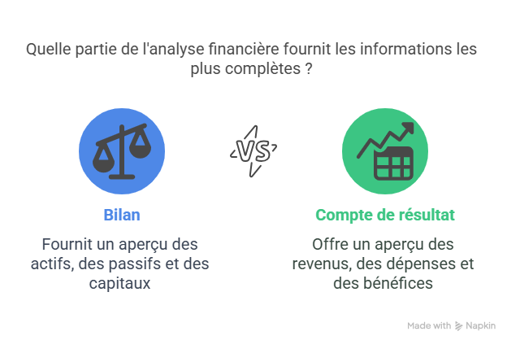

L'analyse financière d'une entreprise à partir de ses documents comptables est un processus rigoureux et essentiel pour évaluer sa santé globale. Elle se décompose principalement en deux grandes parties : la **lecture financière du bilan** et la **lecture financière du compte de résultat**, complétées par les informations précieuses de l'**annexe**.

---

## 1. Lecture Financière du Bilan : L'Analyse Structurelle

La lecture financière du bilan vise à comprendre la structure financière de l'entreprise, sa capacité à financer ses activités et à faire face à ses engagements. Le point de départ est souvent le **bilan fonctionnel**, qui réorganise les postes comptables pour mieux faire ressortir les cycles d'investissement, de financement et d'exploitation.

### Indicateurs clés du Bilan Fonctionnel

À partir du bilan fonctionnel, l'analyste se concentre sur les trois indicateurs clés des cycles financiers de l'entreprise :

1.  **Fonds de Roulement Net Global (FRNG)**
    * **Définition :** C'est l'excédent des ressources stables (capitaux propres et dettes financières à long terme) sur les emplois stables (actifs immobilisés). Il représente la part des ressources à long terme qui finance les besoins d'exploitation à court terme.
    * **Formule :**
        * `FRNG = Ressources Stables - Emplois Stables`
        * `FRNG = (Capitaux Propres + Dettes Financières à Long Terme) - Actifs Immobilisés`
    * **Interprétation :**
        * **FRNG Positif :** Idéal. Les ressources permanentes couvrent intégralement les immobilisations et financent une partie du cycle d'exploitation. C'est un signe de **sécurité financière et de solvabilité à long terme**.
        * **FRNG Nul :** Les ressources permanentes couvrent juste les immobilisations. Le cycle d'exploitation doit s'autofinancer.
        * **FRNG Négatif :** Alerte rouge. Les ressources permanentes ne suffisent pas à financer les immobilisations, qui sont financées par des dettes à court terme. C'est un signe de **fragilité financière et de risque de déséquilibre financier**.

2.  **Besoin en Fonds de Roulement (BFR)**
    * **Définition :** C'est le besoin de financement généré par le cycle d'exploitation de l'entreprise. Il représente le décalage entre les flux de décaissement (achats, salaires) et les flux d'encaissement (ventes).
    * **Formule :**
        * `BFR = Actif Circulant d'Exploitation (Stocks + Créances clients) - Passif Circulant d'Exploitation (Dettes fournisseurs, dettes fiscales et sociales d'exploitation)`
    * **Interprétation :**
        * **BFR Positif :** Le cycle d'exploitation consomme de la trésorerie (besoin de financement). C'est le cas le plus fréquent pour les entreprises industrielles et commerciales (achètent, stockent, vendent à crédit, et paient les fournisseurs avant d'être payées par les clients). Plus le BFR est élevé, plus l'entreprise a besoin de financement (FRNG ou trésorerie externe).
        * **BFR Négatif :** Le cycle d'exploitation génère de la trésorerie (ressource de financement). C'est le cas typique des grandes surfaces ou des entreprises qui vendent au comptant et ont des délais de paiement importants avec leurs fournisseurs. C'est un signe de **bonne gestion des délais de paiement et des stocks**.

3.  **Trésorerie Nette (TN)**
    * **Définition :** Représente l'excédent ou le déficit de liquidités de l'entreprise. C'est la résultante de la politique de financement/investissement (FRNG) et de la gestion de l'exploitation (BFR).
    * **Formule :**
        * `TN = FRNG - BFR`
        * `TN = Disponibilités (Actif) - Dettes Financières à Court Terme (Passif)`
    * **Interprétation :**
        * **TN Positive :** L'entreprise a un excédent de liquidités. C'est un signe de **bonne santé financière et de capacité à faire face aux imprévus et à investir**.
        * **TN Négative :** L'entreprise est en situation de déficit de liquidités, ce qui signifie qu'elle dépend des financements bancaires à court terme (découverts, crédits de campagne) pour couvrir ses besoins. C'est un signe de **fragilité de trésorerie** et de risque de cessation de paiement si la situation perdure sans solution.

### Autres Critères et Ratios d'Analyse du Bilan :

Au-delà du FRNG, BFR, et TN, l'analyse du bilan fonctionnel utilise des ratios pour évaluer la solidité financière et la solvabilité :

* **Ratio d'autonomie financière (ou de solvabilité générale) :**
    * `Capitaux Propres / Total Bilan` ou `Capitaux Propres / Dettes Totales`
    * Mesure la part des ressources propres dans le financement de l'entreprise. Plus il est élevé, plus l'entreprise est solide et indépendante des créanciers.

* **Ratio d'endettement (ou de levier financier) :**
    * `Dettes Financières / Capitaux Propres`
    * Mesure le poids des dettes financières par rapport aux capitaux propres. Un ratio élevé indique une forte dépendance à l'endettement, ce qui peut accroître le risque financier.

* **Ratio de liquidité générale :**
    * `(Actif Circulant) / (Dettes à Court Terme)`
    * Mesure la capacité de l'entreprise à couvrir ses dettes à court terme avec ses actifs à court terme. Un ratio > 1 est généralement souhaitable.

* **Ratio de liquidité réduite (ou test acide) :**
    * `(Actif Circulant - Stocks) / (Dettes à Court Terme)`
    * Similaire au précédent, mais exclut les stocks (qui sont parfois moins liquides ou sujets à des dépréciations), donnant une mesure plus stricte de la liquidité.

---

## 2. Lecture Financière du Compte de Résultat : L'Analyse de la Performance

L'analyse du compte de résultat éclaire la **performance économique** de l'entreprise sur un exercice. Elle ne se limite pas au résultat net, mais cherche à comprendre comment ce résultat est formé, via une cascade de marges appelée **Soldes Intermédiaires de Gestion (SIG)**.

### Indicateurs Clés des Soldes Intermédiaires de Gestion (SIG)

1.  **Marge Commerciale (pour les activités de négoce)**
    * **Formule :** `Ventes de marchandises - Coût d'achat des marchandises vendues`
    * **Interprétation :** Représente la richesse brute créée par l'activité d'achat-revente de l'entreprise. Un bon niveau de marge commerciale est le reflet d'une bonne politique d'achat et de prix de vente.

2.  **Production de l'Exercice (pour les activités de production)**
    * **Formule :** `Ventes de produits + Production stockée + Production immobilisée`
    * **Interprétation :** Mesure l'activité réelle de production de l'entreprise, y compris ce qui est stocké ou immobilisé pour ses propres besoins.

3.  **Valeur Ajoutée (VA)**
    * **Formule :** `Marge Commerciale (ou Production) - Consommations de l'exercice en provenance de tiers` (achats de matières premières, fournitures, services extérieurs, etc.)
    * **Interprétation :** Représente la richesse réellement créée par l'entreprise grâce à son activité propre. C'est la contribution de l'entreprise au PIB. Elle sert à rémunérer le personnel, l'État, les apporteurs de capitaux, et à amortir les investissements.

4.  **Excédent Brut d'Exploitation (EBE)**
    * **Formule :** `Valeur Ajoutée + Subventions d'exploitation - Impôts, taxes et versements assimilés - Charges de personnel`
    * **Interprétation :** C'est le principal indicateur de performance économique et industrielle. Il mesure la richesse dégagée par l'activité opérationnelle **avant** la prise en compte des amortissements, des provisions, du résultat financier et exceptionnel. Un EBE positif et en croissance est un signe de bonne santé opérationnelle. Il représente le cash-flow potentiel généré par le cœur de métier.

5.  **Résultat d'Exploitation (RE)**
    * **Formule :** `EBE + Autres produits d'exploitation - Autres charges d'exploitation + Reprises sur provisions d'exploitation - Dotations aux amortissements et provisions d'exploitation`
    * **Interprétation :** C'est le résultat généré par l'activité normale et courante de l'entreprise. Il intègre les amortissements et provisions, qui sont des charges calculées et non décaissables. C'est un indicateur essentiel de la performance de l'activité principale.

6.  **Résultat Courant Avant Impôts (RCAI)**
    * **Formule :** `Résultat d'Exploitation + Produits financiers - Charges financières`
    * **Interprétation :** Représente la performance de l'entreprise avant les éléments exceptionnels et l'impôt, en tenant compte de sa politique de financement (charges et produits financiers).

7.  **Résultat Net (RN)**
    * **Formule :** `Résultat Courant Avant Impôts + Produits exceptionnels - Charges exceptionnelles - Participation des salariés - Impôts sur les bénéfices`
    * **Interprétation :** C'est le bénéfice ou la perte finale de l'entreprise après toutes les charges et produits, et l'impôt. C'est ce qui revient aux actionnaires ou est mis en réserve. C'est l'indicateur le plus connu, mais il est influencé par des éléments non récurrents (exceptionnels) et des choix fiscaux.

### Ratios de Rentabilité et Autres Critères du Compte de Résultat :

* **Taux de marge d'exploitation :** `Résultat d'Exploitation / Chiffre d'affaires` (mesure la rentabilité de l'activité principale).
* **Taux de marge nette :** `Résultat Net / Chiffre d'affaires` (mesure la rentabilité globale finale).
* **Capacité d'Autofinancement (CAF) :**
    * **Formule simplifiée :** `Résultat Net + Dotations aux Amortissements et Provisions (non décaissables) - Reprises sur provisions (non encaissables)`
    * **Interprétation :** C'est le **flux de trésorerie potentiel** généré par l'activité de l'entreprise. C'est un indicateur crucial pour la capacité de l'entreprise à financer ses investissements et à rembourser ses dettes sans recourir à des financements externes.

---

## 3. Lecture de l'Annexe : Les Informations Complémentaires Indispensables

L'annexe aux comptes annuels est un document obligatoire qui complète et précise les informations du bilan et du compte de résultat. Elle est **cruciale** car elle offre des détails qui ne sont pas visibles directement dans les tableaux financiers.

### Critères et Informations Clés à Rechercher dans l'Annexe :

* **Méthodes Comptables :** Détail des principes et méthodes d'évaluation (stocks : FIFO, CMP ; amortissements : linéaire, dégressif ; provisions, etc.). Cela permet de comprendre comment les chiffres ont été construits et d'évaluer la prudence ou l'agressivité des choix comptables.
* **Détails des Provisions pour Risques et Charges :** Nature, montant, et justification des provisions. Permet de comprendre les risques futurs potentiels (litiges, garanties, restructuration, etc.).
* **Engagements Hors Bilan :** Informations sur les garanties données (cautions, avals), les contrats de crédit-bail ou de location importants, les engagements de retraite, les instruments financiers dérivés. Ces engagements représentent des **risques potentiels non visibles au bilan**.
* **Détails des Dettes et Créances :** Répartition des dettes par échéance, par nature (bancaires, obligataires, fournisseurs), informations sur les taux d'intérêt, les garanties associées.
* **Informations sur les Filiales et Participations :** Liste des filiales, méthodes de consolidation (si applicable).
* **Événements Post-Clôture :** Événements significatifs survenus entre la date de clôture et la date d'établissement des comptes (par ex. acquisition majeure, sinistre, changement réglementaire).
* **Ventilation du Chiffre d'Affaires :** Par activité, par zone géographique. C'est essentiel pour l'analyse de la performance sectorielle et la diversification des risques.
* **Tableau des Flux de Trésorerie (souvent en annexe pour les petites entreprises ou séparé) :** Il retrace les flux d'argent réels (encaissements et décaissements) de l'entreprise, classés par activité (exploitation, investissement, financement). Il est complémentaire à la CAF et essentiel pour comprendre la liquidité.

---

En combinant l'analyse du bilan fonctionnel pour la structure financière, du compte de résultat via les SIG pour la performance, et des informations de l'annexe pour les détails et les risques cachés, un analyste financier peut dresser un tableau complet et nuancé de la santé d'une entreprise.
