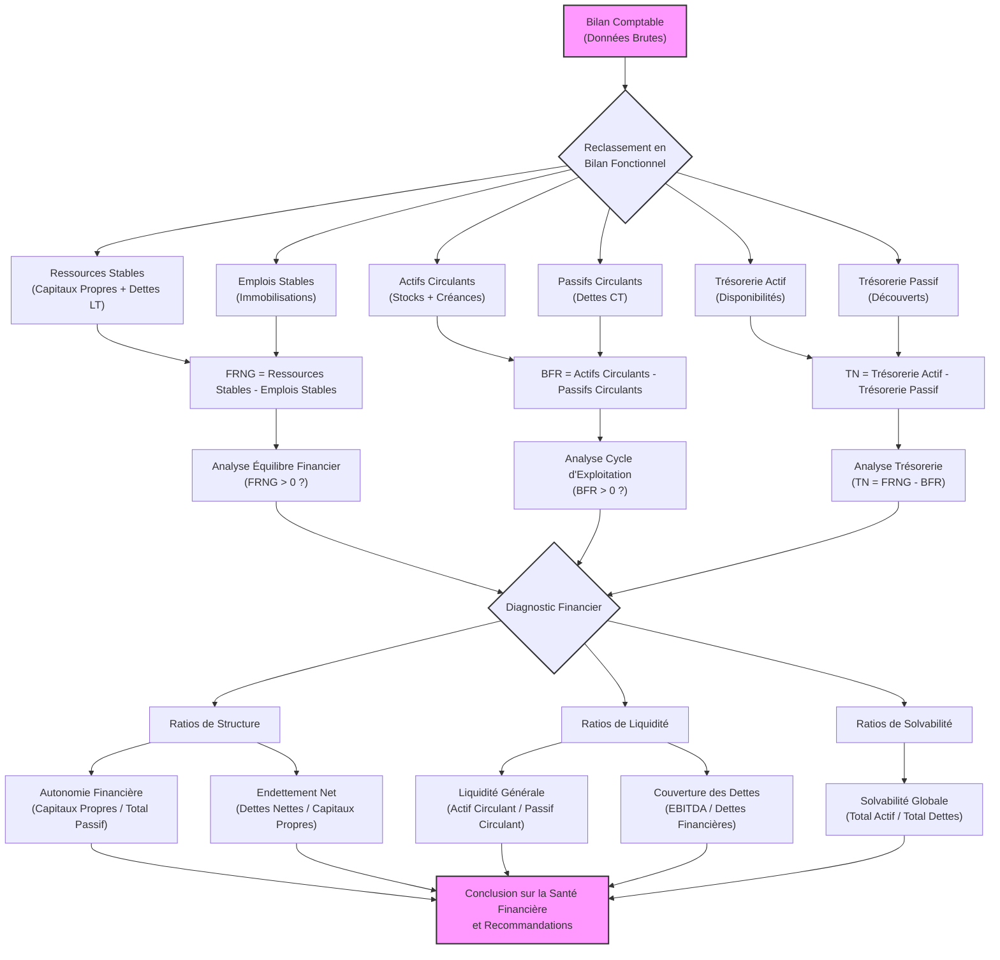
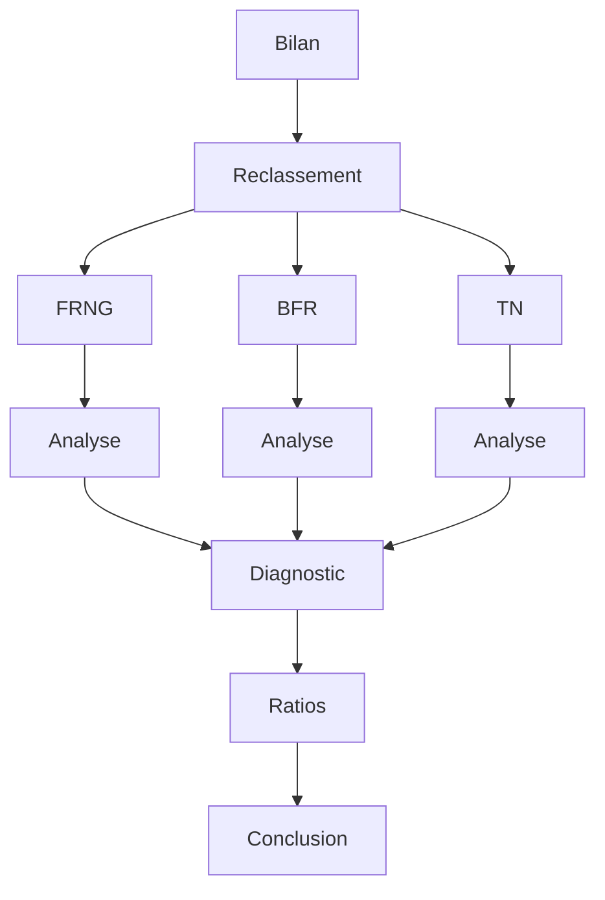
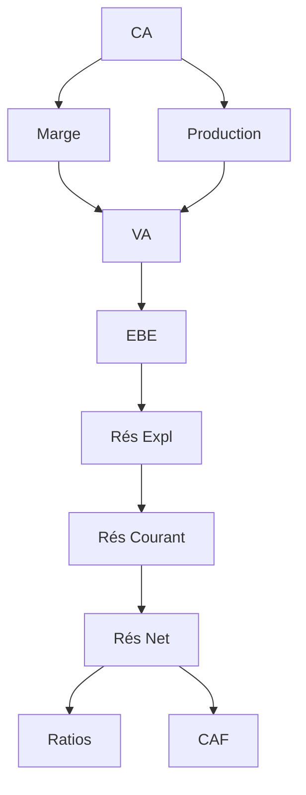
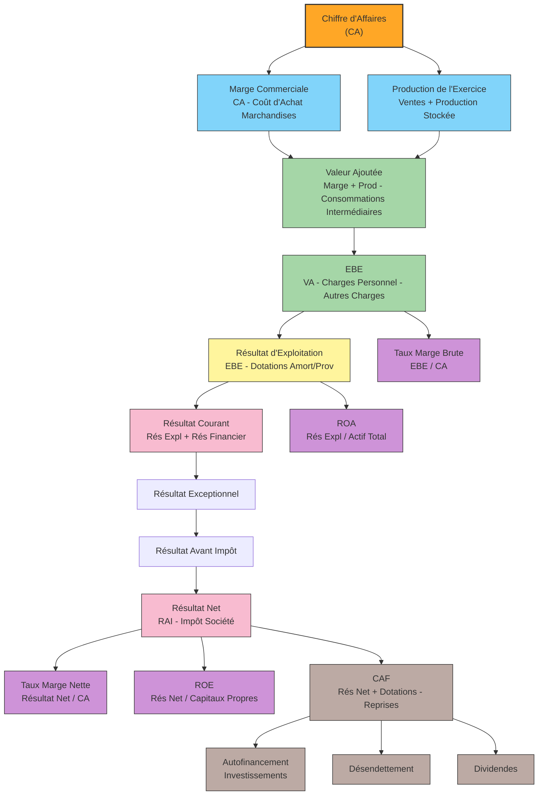

L'analyse financière est un domaine riche et structuré. Pour la lecture du bilan et du compte de résultat, on peut détailler les axes d'analyse de la manière suivante, en se basant sur des approches classiques.

---

## 1. Lecture du Bilan

La lecture du bilan vise à évaluer la **structure financière** de l'entreprise, sa **solvabilité** (sa capacité à faire face à ses dettes à long terme) et sa **liquidité** (sa capacité à faire face à ses dettes à court terme).

### 1.1. Indicateurs du Bilan Fonctionnel

Cette approche réorganise le bilan comptable pour mettre en lumière le cycle d'exploitation et d'investissement de l'entreprise, distinguant les ressources stables des besoins cycliques.

* **1.1.1. Fonds de Roulement Net Global (FRNG)**
    * **Définition :** Mesure l'excédent des ressources stables (capitaux propres et dettes à long terme) par rapport aux emplois stables (immobilisations). Il indique si l'entreprise dispose de ressources durables pour financer ses investissements et une partie de son cycle d'exploitation.
    * **Axes d'analyse :**
        * **FRNG positif :** L'entreprise dispose de ressources à long terme pour financer ses emplois stables et une partie de ses besoins d'exploitation. C'est généralement un signe de bonne santé financière.
        * **FRNG négatif :** L'entreprise finance des emplois stables avec des ressources à court terme, ce qui peut créer des tensions de trésorerie.
        * **FRNG nul :** Les emplois stables sont exactement financés par les ressources stables.

* **1.1.2. Besoin en Fonds de Roulement (BFR)**
    * **Définition :** Représente le besoin de financement généré par l'activité courante de l'entreprise. Il s'agit de la différence entre les emplois d'exploitation (stocks, créances clients) et les ressources d'exploitation (dettes fournisseurs, fiscales, sociales).
    * **Axes d'analyse :**
        * **BFR positif :** L'activité courante nécessite un financement (les emplois d'exploitation sont supérieurs aux ressources d'exploitation). C'est le cas le plus fréquent.
        * **BFR négatif :** L'activité courante génère des ressources (les ressources d'exploitation sont supérieures aux emplois d'exploitation, typique de la grande distribution).
        * **Optimisation du BFR :** Analyse des délais de paiement clients, fournisseurs, et de la rotation des stocks.

* **1.1.3. Trésorerie Nette (TN)**
    * **Définition :** Représente l'argent disponible (ou manquant) dans l'entreprise. C'est la différence entre le FRNG et le BFR (TN = FRNG - BFR), ou directement la différence entre les disponibilités et les concours bancaires courants.
    * **Axes d'analyse :**
        * **TN positive :** L'entreprise dispose d'un excédent de liquidités, signe de bonne gestion.
        * **TN négative :** L'entreprise est en situation de déficit de trésorerie, souvent financé par des découverts bancaires.

### 1.2. Ratios de Bilan

Les ratios permettent de comparer des grandeurs du bilan pour évaluer la santé financière de l'entreprise, souvent en les comparant à des moyennes sectorielles ou à des performances passées.

* **1.2.1. Ratios de Structure Financière (Autonomie Financière)**
    * **Endettement Net / Capitaux Propres :** Mesure la dépendance de l'entreprise vis-à-vis de ses créanciers par rapport à ses propres fonds.
    * **Dettes Financières / EBITDA :** Indique la capacité de l'entreprise à rembourser ses dettes grâce à sa capacité d'exploitation.
    * **Capitaux Propres / Total Bilan :** Représente la part des ressources propres dans le financement total de l'entreprise.

* **1.2.2. Ratios de Liquidité**
    * **Ratio de Liquidité Générale (Current Ratio) :** Actifs Circulants / Passifs Circulants. Mesure la capacité de l'entreprise à rembourser ses dettes à court terme avec ses actifs à court terme.
    * **Ratio de Liquidité Réduite (Quick Ratio / Acid-Test Ratio) :** (Actifs Circulants - Stocks) / Passifs Circulants. Une mesure plus stricte de la liquidité, excluant les stocks (moins liquides).
    * **Ratio de Liquidité Immédiate (Cash Ratio) :** (Disponibilités) / Passifs Circulants. La capacité de rembourser les dettes à court terme uniquement avec le cash.

* **1.2.3. Ratios de Solvabilité (Capacité à faire face aux dettes à long terme)**
    * **Ratio d'Endettement (Gearing Ratio) :** Dettes Totales / Capitaux Propres. Évalue la proportion de l'endettement par rapport aux fonds propres.
    * **Ratio de Solvabilité Globale :** Actifs Totaux / Dettes Totales. Mesure la capacité de l'entreprise à couvrir l'ensemble de ses dettes avec l'ensemble de ses actifs.

---
### Diagramme

### Version simplifiée

    
---

## 2. Lecture du Compte de Résultat

La lecture du compte de résultat a pour objectif d'analyser la **performance économique** de l'entreprise sur une période donnée, en identifiant l'origine de son résultat (produits et charges).

### 2.1. Soldes Intermédiaires de Gestion (SIG)

Les SIG sont une décomposition progressive du résultat de l'entreprise, permettant de comprendre comment la richesse est créée et répartie, et d'identifier les différents niveaux de performance.

* **2.1.1. Marge Commerciale**
    * **Définition :** Pour les entreprises commerciales, c'est la différence entre les ventes de marchandises et le coût d'achat des marchandises vendues.
    * **Axes d'analyse :** Capacité à dégager un profit sur les ventes de base.

* **2.1.2. Production de l'Exercice**
    * **Définition :** Pour les entreprises industrielles et de services, elle comprend les ventes de biens et services, la production immobilisée et la production stockée.
    * **Axes d'analyse :** Mesure du niveau d'activité de l'entreprise.

* **2.1.3. Valeur Ajoutée (VA)**
    * **Définition :** Mesure la richesse créée par l'entreprise de par son activité propre (Production de l'exercice + Marge Commerciale - Consommations Intermédiaires).
    * **Axes d'analyse :** Capacité de l'entreprise à générer de la valeur au-delà de ce qu'elle consomme chez des tiers.

* **2.1.4. Excédent Brut d'Exploitation (EBE)**
    * **Définition :** Représente la richesse générée par le cycle d'exploitation de l'entreprise avant la prise en compte des amortissements, provisions, résultats financiers et exceptionnels. C'est la performance économique pure.
    * **Axes d'analyse :** Potentiel de l'entreprise à générer du cash flow à partir de son activité principale.

* **2.1.5. Résultat d'Exploitation (RE)**
    * **Définition :** Mesure la performance économique de l'activité principale de l'entreprise après déduction des amortissements et provisions d'exploitation.
    * **Axes d'analyse :** Performance récurrente de l'entreprise, indépendante de la politique financière ou des événements exceptionnels.

* **2.1.6. Résultat Financier**
    * **Définition :** Différence entre les produits financiers (intérêts perçus, dividendes) et les charges financières (intérêts payés sur les emprunts).
    * **Axes d'analyse :** Impact de la politique de financement et des placements sur le résultat.

* **2.1.7. Résultat Courant Avant Impôt (RCAI)**
    * **Définition :** Somme du résultat d'exploitation et du résultat financier.
    * **Axes d'analyse :** Performance de l'activité normale et récurrente de l'entreprise, avant éléments exceptionnels et impôt.

* **2.1.8. Résultat Exceptionnel**
    * **Définition :** Résultat généré par des opérations non récurrentes et non liées à l'activité normale de l'entreprise (ex: cession d'immobilisation, pénalités).
    * **Axes d'analyse :** Identifier les éléments ponctuels qui influencent le résultat global.

* **2.1.9. Impôt sur les Sociétés (IS)**
    * **Définition :** Charge fiscale due par l'entreprise sur son résultat.
    * **Axes d'analyse :** Impact de la fiscalité.

* **2.1.10. Résultat Net Comptable (RNC)**
    * **Définition :** Le bénéfice ou la perte finale de l'entreprise après prise en compte de toutes les charges et produits.
    * **Axes d'analyse :** Indicateur de performance global et base du calcul des dividendes ou de l'autofinancement.

### 2.2. Ratios de Compte de Résultat (Ratios de Rentabilité)

Ces ratios permettent d'évaluer la capacité de l'entreprise à générer du profit à partir de son activité ou de ses capitaux.

* **2.2.1. Ratios de Rentabilité Commerciale**
    * **Taux de Marge Brute :** (Marge Commerciale / Ventes de Marchandises) ou (EBE / Chiffre d'Affaires). Mesure la part de la richesse dégagée par rapport au chiffre d'affaires.
    * **Taux de Marge Nette :** (Résultat Net / Chiffre d'Affaires). Mesure la part du bénéfice net par rapport au chiffre d'affaires.

* **2.2.2. Ratios de Rentabilité Économique et Financière**
    * **Rentabilité Économique (ROA - Return on Assets) :** (Résultat d'Exploitation ou EBE) / Actif Total. Mesure la capacité des actifs de l'entreprise à générer du profit.
    * **Rentabilité des Capitaux Propres (ROE - Return on Equity) :** Résultat Net / Capitaux Propres. Mesure le rendement généré pour les actionnaires.
    * **Taux de Distribution (Payout Ratio) :** Dividendes Distribués / Résultat Net. Part du bénéfice net qui est reversée aux actionnaires.

### 2.3. Analyse de la Capacité d'Autofinancement (CAF)

* **2.3.1. Calcul de la CAF**
    * **Définition :** Représente les ressources financières générées par l'activité propre de l'entreprise, avant distribution de dividendes et remboursement d'emprunts. C'est un indicateur clé de sa capacité à financer ses investissements et à rembourser ses dettes.
    * **Axes d'analyse :**
        * **CAF positive et stable :** L'entreprise génère suffisamment de cash pour ses opérations, réduisant sa dépendance au financement externe.
        * **CAF en baisse :** Peut indiquer une dégradation de la performance ou une augmentation des charges non décaissables.

* **2.3.2. Utilisation de la CAF**
    * **Axes d'analyse :**
        * **Financement des investissements :** Une CAF élevée permet de financer les nouveaux actifs sans s'endetter.
        * **Remboursement des dettes :** Contribue à améliorer la structure financière.
        * **Distribution de dividendes :** La part restante après les besoins d'investissement et de désendettement peut être distribuée aux actionnaires.

---
### Diagram simplifié

### Diagram élaboré

Cette subdivision offre une vue d'ensemble complète des axes d'analyse pour la lecture du bilan et du compte de résultat, permettant une évaluation approfondie de la santé financière et de la performance d'une entreprise.